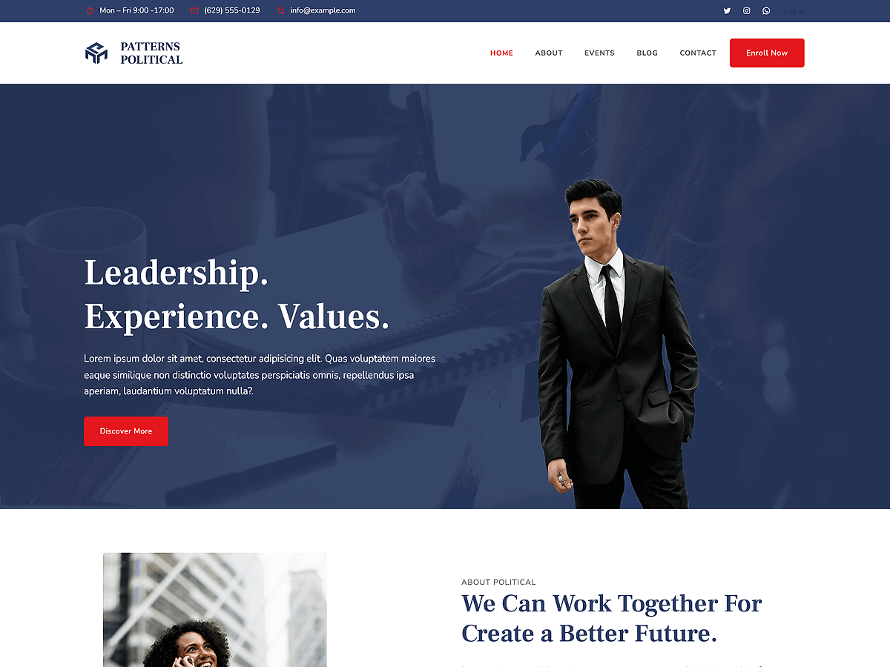

# Patterns Political

Patterns Political is a bold and professional WordPress theme designed for political campaigns, government organizations, candidates, advocacy groups, and ethnic or social organizations. Built with WordPress Full Site Editing (FSE), this theme allows seamless customization of headers, footers, templates, and global styles directly within the WordPress Site Editor. The theme includes pre-designed patterns and layouts crafted for showcasing campaign messages, policy highlights, upcoming events, volunteer opportunities, donation calls-to-action, and contact information. Includes layouts for feature sections, issues, about the candidate, campaign timeline, event listings, donation pages, team introductions, testimonials, contact pages, and more. Its responsive design ensures that your website looks impactful and accessible on all devices, providing a powerful platform to engage with voters and supporters.

Primary color: `#233359`.



## Features

- 3 hero and landing patterns
- 5 card layouts (card-1 through card-5)
- 5 archive/post-listing patterns
- Contact page pattern (page-contact)
- 1 menu navigation pattern
- Event page pattern
- 13 section layout patterns (featured sections and section titles)
- Full Site Editing (FSE) support
- Responsive design
- 65 block patterns + 15 templates + 11 template parts
- Political campaign oriented layouts (events, issues, contact)

## Requirements

- WordPress 6.6 or higher
- PHP 7.0 or higher
- Tested up to WordPress 6.7

## Development

This theme uses `@wordpress/scripts`:

```sh
npm install
npm run start    # dev mode with watch
npm run build    # production build
```

## License

GNU General Public License v2 or later.

This theme is based on [WP Block Theme Boilerplate](https://github.com/codersantosh/wp-block-theme-boilerplate), (C) 2025 Santosh Kunwar, [GPLv2 or later](https://www.gnu.org/licenses/gpl-2.0.html).
